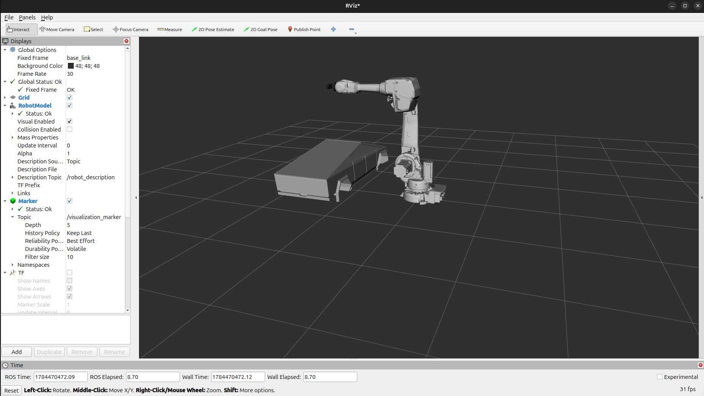
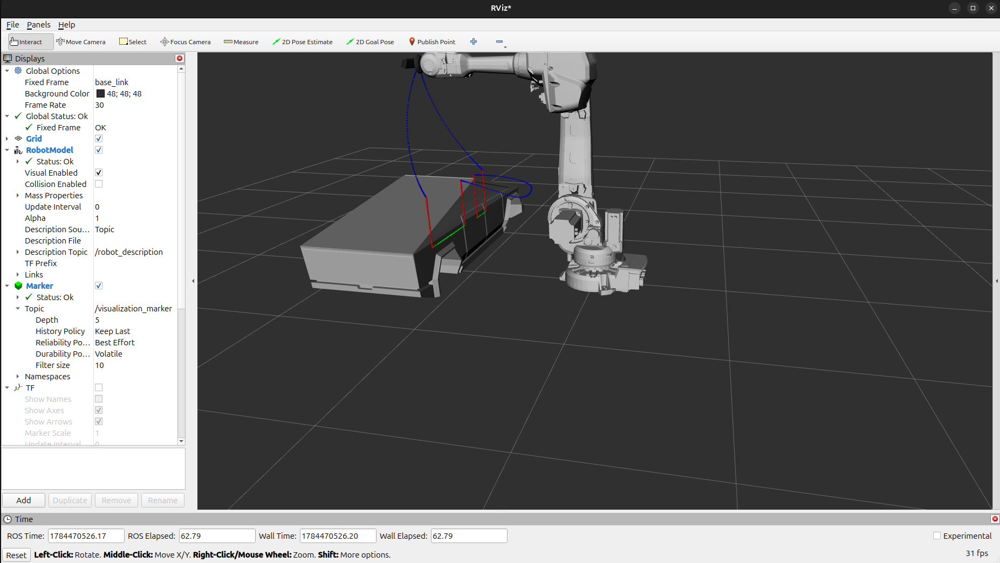
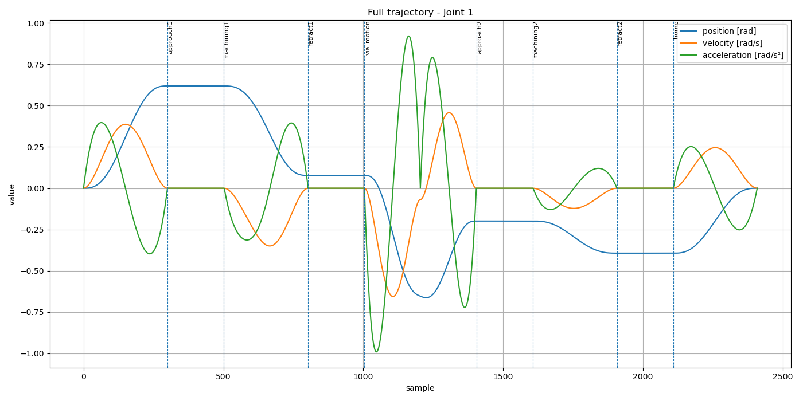

# ROS 2 Trajectory Generation for ABB IRB 4600

A ROS 2 project that implements low-level trajectory generation, inverse kinematics and motion visualization for a 6-axis ABB IRB 4600 industrial robot.

The project demonstrates how robot trajectories can be generated and executed without using high-level motion-planning frameworks such as MoveIt.

## Project Overview

The system simulates a machining process in which the ABB IRB 4600 robot moves between predefined configurations and processes two selected edges of a workpiece.

The complete workflow includes:

* teaching robot configurations;
* inverse kinematics;
* point-to-point motion;
* linear Cartesian motion;
* motion through a VIA configuration;
* approach and retract segments;
* robot-state publication;
* trajectory visualization in RViz;
* joint-data logging and analysis.

## Features

* ROS 2 nodes implemented in C++;
* ABB IRB 4600 robot model in RViz;
* interactive pose teaching;
* real-time inverse kinematics using IKFast;
* point-to-point trajectory generation in joint space;
* PTP motion through a VIA configuration;
* linear Cartesian trajectory generation;
* constant tool orientation during LIN motion;
* approach and retract motion segments;
* service-based execution of the complete sequence;
* robot-state publication;
* tool-path visualization in RViz;
* CSV logging of joint position, velocity and acceleration;
* visualization of a custom workpiece model;
* compatibility with ROS 2 Jazzy and Ubuntu 24.04.

## Technologies

* Ubuntu 24.04
* ROS 2 Jazzy
* C++17
* Eigen3
* RViz2
* IKFast
* ROS 2 services, topics and markers
* Python or PlotJuggler for trajectory analysis

## Project Structure

```text
block1_stanislavskyi/
├── docs/
│   ├── rviz_initial_scene.png
│   ├── rviz_trajectory_result.png
│   └── trajectory_analysis/
│       ├── joint_1_trajectory_analysis.png
│       ├── joint_2_trajectory_analysis.png
│       ├── joint_3_trajectory_analysis.png
│       ├── joint_4_trajectory_analysis.png
│       ├── joint_5_trajectory_analysis.png
│       └── joint_6_trajectory_analysis.png
├── include/
│   └── block1_stanislavskyi/
│       └── manipulator.hpp
├── launch/
│   ├── demo.launch.py
│   ├── model_spawner.launch.py
│   └── pose_teacher.launch.py
├── meshes/
│   └── truck.stl
├── src/
│   ├── manipulator.cpp
│   ├── manipulator_node.cpp
│   ├── model_spawner.cpp
│   └── pose_teacher.cpp
├── srv/
│   └── ExecuteMachining.srv
├── CMakeLists.txt
├── package.xml
└── README.md
```

## ROS 2 Nodes

### `model_spawner`

Publishes the workpiece model as a visualization marker.

Published topic:

```text
/visualization_marker
```

### `pose_teacher`

Provides an interactive 6-DOF marker in RViz.

The marker can be moved manually, while inverse kinematics is calculated in real time. After releasing the marker, the corresponding robot joint configuration is printed in the terminal.

This node can be used to obtain configurations for:

* `T1` — start of the first machining edge;
* `T2` — end of the first machining edge;
* `T3` — start of the second machining edge;
* `T4` — end of the second machining edge;
* `Tvia` — intermediate robot configuration.

### `manipulator_node`

Generates and executes the complete machining sequence.

It is responsible for:

* generating PTP trajectories;
* generating PTP trajectories through a VIA configuration;
* generating Cartesian LIN trajectories;
* publishing robot joint states;
* publishing the current manipulator state;
* visualizing the tool path;
* recording trajectory data;
* providing the `/execute_machining` service.

## Motion Types

### Point-to-Point Motion

PTP motion is generated in joint space.

Each robot joint is interpolated between the initial and final configurations. The trajectory is generated with approximately zero velocity and acceleration at its endpoints.

### PTP Motion Through a VIA Configuration

The robot moves from the initial configuration to the target configuration through a predefined intermediate configuration.

The VIA configuration is used to control the transition between different machining areas.

### Linear Cartesian Motion

LIN motion is generated in Cartesian space.

During the control loop:

1. the desired Cartesian position is interpolated along a straight line;
2. the tool orientation remains constant;
3. inverse kinematics is calculated for every trajectory point;
4. the IK solution closest to the previous robot configuration is selected.

This reduces unnecessary changes between different inverse-kinematics solutions.

## Machining Sequence

The complete sequence contains the following stages:

1. Move from the Home configuration toward the first machining area.
2. Approach the first edge.
3. Machine the first edge from `T1` to `T2`.
4. Retract from the first edge.
5. Move through the `Tvia` configuration toward the second machining area.
6. Approach the second edge.
7. Machine the second edge from `T3` to `T4`.
8. Retract from the second edge.
9. Return to the Home configuration.

## Manipulator States

The current robot state is published on:

```text
/manipulator/state
```

The following states are used:

| Value | State         |
| ----: | ------------- |
|     0 | `IDLE`        |
|     1 | `PTP`         |
|     2 | `APPROACHING` |
|     3 | `MACHINING`   |
|     4 | `RETRACTING`  |
|     5 | `DONE`        |
|     6 | `ERROR`       |

## ROS 2 Interfaces

### Topics

```text
/joint_states
/visualization_marker
/tool_path
/manipulator/state
/tf
/tf_static
```

### Service

```text
/execute_machining
```

Service type:

```text
block1_stanislavskyi/srv/ExecuteMachining
```

## Requirements

Before building the project, install ROS 2 Jazzy and the required dependencies.

The project also requires the custom IKFast package:

```text
abb_irb4600_ikfast
```

The IKFast package must be available in the same ROS 2 workspace or in a sourced ROS 2 environment.

## Build

Place the package inside the `src` directory of a ROS 2 workspace:

```text
~/robotics_ws/src/block1_stanislavskyi
```

Build the project:

```bash
cd ~/robotics_ws

source /opt/ros/jazzy/setup.bash

colcon build \
  --symlink-install \
  --packages-select block1_stanislavskyi
```

After a successful build, source the workspace:

```bash
source ~/robotics_ws/install/setup.bash
```

## Run the Complete Demo

Start the robot model, workpiece, manipulator node and RViz:

```bash
source /opt/ros/jazzy/setup.bash
source ~/robotics_ws/install/setup.bash

ros2 launch block1_stanislavskyi demo.launch.py
```

Keep this terminal open.

In a second terminal, execute the machining sequence:

```bash
source /opt/ros/jazzy/setup.bash
source ~/robotics_ws/install/setup.bash

ros2 service call \
  /execute_machining \
  block1_stanislavskyi/srv/ExecuteMachining \
  "{}"
```

A successful response should contain:

```text
success: true
message: Machining sequence executed
```

## Run the Pose Teacher

To teach or inspect robot configurations:

```bash
source /opt/ros/jazzy/setup.bash
source ~/robotics_ws/install/setup.bash

ros2 launch block1_stanislavskyi pose_teacher.launch.py
```

Use the interactive marker in RViz to move the end effector.

After releasing the marker, the calculated joint configuration is printed in the terminal.

## Visualization

### Initial RViz Scene

The initial scene contains the ABB IRB 4600 robot and the workpiece model before trajectory execution.



### Generated Trajectory

The complete tool path is visualized in RViz.

Trajectory colors:

* blue — PTP movement;
* red — approach and retract movement;
* green — linear machining movement.



## Trajectory Logging

During trajectory execution, the following values are recorded for all six joints:

* joint position in radians;
* joint velocity in radians per second;
* joint acceleration in radians per second squared;
* trajectory segment name;
* trajectory time.

The data are saved to:

```text
~/trajectory_log.csv
```

CSV structure:

```text
motion,t,
j1,j2,j3,j4,j5,j6,
dj1,dj2,dj3,dj4,dj5,dj6,
ddj1,ddj2,ddj3,ddj4,ddj5,ddj6
```

## Trajectory Analysis

Joint position, velocity and acceleration were recorded during the complete machining sequence.

The vertical dashed lines indicate transitions between individual motion segments.



Additional trajectory-analysis plots are available for all six robot joints:

* [Joint 1](docs/trajectory_analysis/joint_1_trajectory_analysis.png)
* [Joint 2](docs/trajectory_analysis/joint_2_trajectory_analysis.png)
* [Joint 3](docs/trajectory_analysis/joint_3_trajectory_analysis.png)
* [Joint 4](docs/trajectory_analysis/joint_4_trajectory_analysis.png)
* [Joint 5](docs/trajectory_analysis/joint_5_trajectory_analysis.png)
* [Joint 6](docs/trajectory_analysis/joint_6_trajectory_analysis.png)

The plots are used to inspect:

* joint-position continuity;
* joint velocities during individual motion segments;
* joint accelerations during individual motion segments;
* robot behavior at transitions between PTP, LIN, approach, retract and VIA movements;
* convergence toward the final Home configuration.

At the beginning and at the final Home position, joint velocity and acceleration approach zero.

## Demonstration Video

Recommended video filename:

```text
ros2_abb_irb4600_trajectory_demo.mp4
```

## Known Limitations

* PTP trajectories are generated in joint space.
* The project does not implement full collision checking.
* Intermediate Cartesian tool paths during PTP movement are not guaranteed to be straight.
* Machining configurations and the VIA configuration are manually taught.
* Individual motion segments are generated separately.
* Velocity and acceleration may change at transitions between different motion segments.
* The current implementation is primarily evaluated in RViz.
* The workpiece model is used mainly for visualization.
* The project does not use MoveIt or another high-level motion-planning framework.

## Possible Future Improvements

* integration with MoveIt collision checking;
* automatic detection of workpiece edges;
* integration with an RGB-D or 3D camera;
* point-cloud processing;
* automatic object-pose estimation;
* real robot execution;
* improved blending between trajectory segments;
* configurable trajectory parameters through ROS 2 parameters;
* automated trajectory-quality evaluation;
* vision-guided robot control.

## Author

**Mykola Stanislavskyi**

ROS 2 robotics project developed for educational and portfolio purposes.
